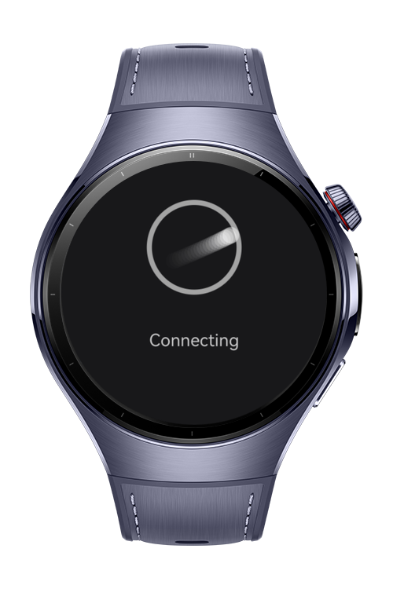
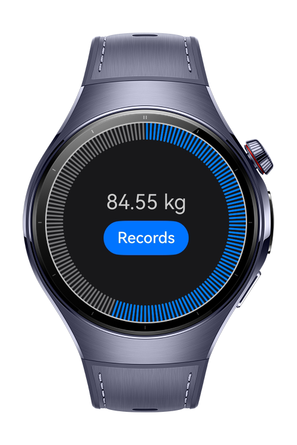
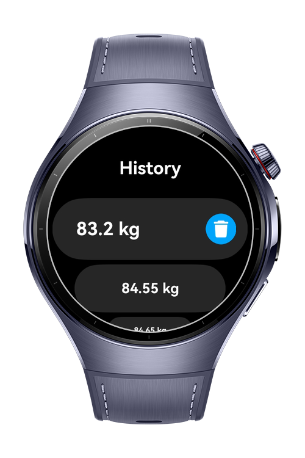

> **Note:** To access all shared projects, get information about environment setup, and view other guides, please visit [Explore-In-HMOS-Wearable Index](https://github.com/Explore-In-HMOS-Wearable/hmos-index).

# Smart Scale – HarmonyOS Wearable App

A lightweight and smart body-weight tracking application designed for HarmonyOS Next wearable devices.
The app reads weight data from Mi Scale 2 via Bluetooth, stores measurements in a local database, and visualizes the
user’s weight trends over time.

# Preview

<div>
    
    
    
    
</div>

# Use Cases

- Bluetooth Weight Reading
    - Automatically receives real-time weight measurements from Mi Scale 2.
    - Stable and optimized BLE connection logic.
- Local Data Storage
    - All measurements are saved securely using HarmonyOS Relational Database (RDB).
    - Users can delete any record by swiping it.
- History Tracking
    - Users can browse previously saved records.
    - Provides a clean list interface optimized for small wearable screens.
- Weight Trend Visualization
    - Displays the latest 10 measurements as a smooth line chart.
    - Helps users understand short-term weight changes at a glance.
- Modern UI Components
    - Built with ArkUI and wearable-friendly layouts.
    - Fluid animations and clean ArcList design.

# Tech Stack

- **Languages**: ArkTS
- **Frameworks**: HarmonyOS SDK 5.1.0(18)
- **Tools**: DevEco Studio Version 5.1.0
- **Libraries**: 
  - @kit.ArkUI
  - @kit.ConnectivityKit
  - @kit.ArkData
  - @mcui/mccharts

# Directory Structure

````
├───AppScope
│   └───resources
│       └───base
│           ├───element
│           └───media
├───entry
│   └───src
│       ├───main
│       │   ├───ets
│       │   │   ├───model
│       │   │   │   └───WeightModel
│       │   │   ├───utils 
│       │   │   │   ├───PermissionManager
│       │   │   │   └───RdbService
│       │   │   └───pages 
│       │   │       ├───Main
│       │   │       ├───Records
│       │   │       └───WeightChart
│       │   └───resources
│       │       ├───base
│       │       │   ├───element
│       │       │   ├───media
│       │       │   └───profile
````

# Constraints and Restrictions

## Suported Devices

- Huawei Watch 5

## Development Notes

- The data parsing steps for this application have been developed only for **Mi Scale 2**. For other smart scales, you can use
  the [Open Scale Repository](https://github.com/oliexdev/openScale).

# LICENSE

**Smart Scale** is distributed under the terms of the MIT License.
See the [LICENSE](/LICENSE) for more information.
